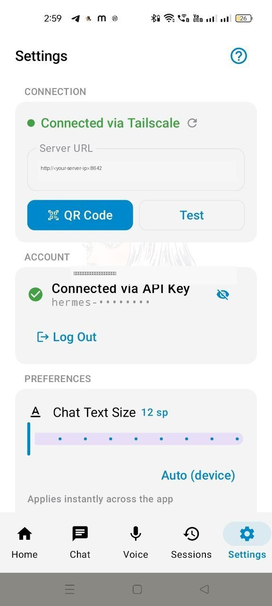

# Hermes Mobile Plugin

<p align="center">
  
  
  
  
</p>

The server-side half of **Hermes Mobile**: one plugin that turns your running
[Hermes Agent](https://hermes-agent.nousresearch.com) into a phone-ready hub — QR pairing, voice,
files, and server management. No extra daemon, no cloud relay: everything is mounted on the
gateway you already run (default port **8642**).

> You install **Hermes Agent** from the official site, then this **one plugin**. That's the whole
> server-side setup.

## What you get



*Settings in the app after scanning the QR: server URL + key configured, connection live.*

| Capability | What it means for you |
|---|---|
| **QR pairing** | `install` prints/opens a QR with URL + API key; the app scans it (camera or gallery) and configures + tests the connection itself. |
| **Voice on-device** | Speech-to-text (Whisper) and text-to-speech routes on the gateway, so the phone mic/speaker work with zero extra services. |
| **File transfer** | Upload attachments from the phone, download anything the agent creates — the chat shows real file cards, previewable in-app. |
| **Context meter** | Live token usage / context window per session, straight from server truth. |
| **Slash commands** | The app's `/` menu is built from your actual server commands, not a hardcoded list. |
| **Update from your phone** | About screen checks and applies `hermes update` on the server — restart included. |
| **Keep-awake control** | Toggle the Termux/system wake lock remotely so long runs aren't killed. |
| **24/7 supervisor** | Optional watchdog auto-restarts the gateway if it ever dies, and survives reboots of the app. |
| **Crash reports** | The app pushes its crash dumps here (`~/.hermes/mobile-logs/diag/`) so issues are diagnosable without cables. |
| **Swarm-ready** | Turns started with the app's Swarm toggle carry their own orchestration directives — no extra server setup. |

Nothing is re-implemented: STT/TTS reuse Hermes Agent's own provider chain, sessions/models are
read from the agent's API. The plugin adds routes, not forks.

## Install

**[Download the latest release →](https://github.com/tawaresachin/hermes-mobile-plugin/releases/latest)**
(every release ships a pure-Python `py3-none-any` wheel + sdist with `SHA256SUMS` checksums, built and version-verified by CI)

Into the same Python environment your Hermes Agent runs in (its venv):

```bash
pip install git+https://github.com/tawaresachin/hermes-mobile-plugin@v0.0.12
# or from the release page: pip install hermes_mobile_plugin-<ver>-py3-none-any.whl
hermes-mobile-plugin install      # registers plugin + generates the QR
```

The plugin is pure Python — the one wheel runs unchanged on Windows, macOS, Linux and
Termux (native deps resolve per-OS from PyPI at install time). Not on PyPI; GitHub Releases
is the release channel, which matches how Hermes Agent itself updates from git.

`install` copies the plugin into the Hermes home your agent actually resolves (`~/.hermes` on Linux/Termux, XDG dirs on macOS, `%LOCALAPPDATA%\hermes` on Windows) and (re)starts the gateway.
Then grab the [Hermes Mobile APK](https://github.com/tawaresachin/hermes-mobile/releases), open
**Settings → Connect with QR**, and scan. LAN, Tailscale, or any tunnel — the QR carries the
address your phone can actually reach.

## CLI

```text
hermes-mobile-plugin install      # set up + show QR
hermes-mobile-plugin qr           # regenerate the QR (--no-browser)
hermes-mobile-plugin status       # supervisor + gateway health
hermes-mobile-plugin supervisor --start|--stop|—daemon 24/7 watchdog
```

## HTTP routes (all Bearer-key protected)

Mounted on the api_server platform; the mobile app is the client.

| Route | Purpose |
|---|---|
| `POST /api/audio/transcribe` · `POST /api/audio/speak` | STT / TTS |
| `POST /api/audio/upload` · `GET /api/audio/download/{sid}/{name}` | attachments both ways |
| `GET /api/mobile/file` | fetch agent-created files for MEDIA cards |
| `GET /api/mobile/commands` · `POST /api/mobile/command/resolve` | slash-command menu |
| `GET /api/mobile/context-usage` · `GET /api/mobile/context-window` | context meter |
| `GET /api/mobile/update/check` · `POST /update/apply` · `GET /update/version` | server self-update |
| `GET /api/system/status` · `POST /api/system/awake` | host status, keep-awake |
| `POST /api/diag/log` · `GET /api/audio/health` | crash reports, liveness |

## Cross-platform

Runs wherever Hermes Agent runs — **Windows, macOS, Linux, Termux/Android** — with per-platform
handling for process detachment, single-instance locks, launcher lookup (`hermes.exe` included),
and keep-awake (termux-wake-lock / caffeine / powershell), degrading honestly when a mechanism
doesn't exist. 53 tests cover the platform seams and the scripted-install paths.

**Termux note:** the shell installer skips pip there (it can trigger NDK toolchain builds);
Hermes Agent's own Termux environment must provide `pyyaml`, `qrcode` and `aiohttp` — the
standard agent install does.

## Development

```bash
git clone https://github.com/tawaresachin/hermes-mobile-plugin.git
cd hermes-mobile-plugin
pip install -e ".[dev]"
PYTHONPATH=src pytest            # 53 tests
```

CI (`.github/workflows/ci.yml`) runs the suite on ubuntu/macos/windows on every push, plus
sandboxed end-to-end dry-runs of `install.sh` (Linux + macOS, including the Termux skip-pip
path) and `install.bat` (Windows, fake venv + redirected home). Version tags additionally
build the wheel, verify the bundled manifest matches the tag, and attach it to the release.

Releases are tagged `v<version>`; `plugin.yaml` is the single source of the version string
(`PLUGIN_VERSION` derives from it — packaging metadata can't drift).

## License

MIT © 2026 Sachin Taware
